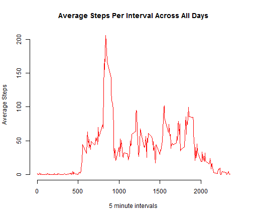

Personal Activity Monitoring Analysis  
=========================================================================
  
**Reproducible Research - Project 1**
  
  
  
This analysis makes use of activity data obtained from personal monitoring devices.  The analysis answers the following questions:  
  
1)  What is the mean and median total number of steps taken each day?  
2)  What is the average daily activity pattern and which 5 minute interval on   average contains the max number of steps?  
3)  Are there differences in activity patterns between weekdays and weekends?  
  
Prior to the last step, missing data is imputed from existing data mean values.  
  
  
The source data for this analysis can be accessed [here][1].  The download file   contains a comma separated file activity.csv with the following variables:  
  
- steps:    Number of steps taking in a 5-minute interval (missing values are coded as NA)  
- date:     The date on which the measurement was taken in YYYY-MM-DD format  
- interval: Id for the 5-minute interval in which measurement was taken  
    
This file contains 17,568 observations.  
  
  
**Step 1:** Set the working directory, read in download file and pre-process data for later use.  
  

```r
setwd ('C:/Users/lrich_000/Desktop/Data Science/Class 5/Project 1')
df <- read.csv ("activity.csv", 
                header = TRUE, 
                sep=",",  
                col.names=c("steps", "date", "interval"),   
                colClasses=c("numeric","character","character"))
df$mins <- (trunc(as.numeric(df$interval) / 100)  * 60) + (100 * ((as.numeric(df$interval)/100) - trunc(as.numeric(df$interval) / 100)))
```
  
  
**Step 2:** What is mean total number of steps taken per day?  
   a) Make a histogram of the total number of steps taken each day  

```r
stepsSum <- tapply(df$steps, df$date, sum)
```

```r
hist(stepsSum, breaks = 10, col = "gray", 
            main = "Histogram of Total Steps Taken Each Day", 
            xlab = "Steps Taken Each Day")
```

 
  
   b) Calculate and report the mean and median total number of steps taken per day  
   

```r
stepsMean <- mean(stepsSum, na.rm = T)
stepsMedian <- median(stepsSum, na.rm = T)
```
> **Mean steps take each day:   1.0766 &times; 10<sup>4</sup>** 
  
> **Median steps take each day: 1.0765 &times; 10<sup>4</sup>**  
  
  
  
**Step 3:** What is the average daily activity pattern?
   a) Make a time series plot (i.e. type = "l") of the 5-minute interval (x-axis) and the average number of steps taken, averaged across all days (y-axis)  
   

```r
stepsAvg <- unique(cbind(df$interval, as.numeric(tapply(df$steps, df$mins, mean, na.rm = T))))
```
  

```r
plot(stepsAvg, type = "l", col = "red", xlab = "5 minute intervals",  
    ylab = "Average Steps", main = "Average Steps Per Interval Across All Days",
    frame = F)
```

 
  
   b) Which 5-minute interval, on average across all the days in the dataset, contains the maximum number of steps?
  

```r
interval <- subset(stepsAvg, (as.numeric(stepsAvg[,2])== max(as.numeric(stepsAvg[,2]))))[1] 
```
> **Five minute Interval which on average contained the maximum number of steps:  835**
  
  
  
**Step 4:** Impute missing values.  
   a) Calculate and report the total number of missing values in the dataset 

```r
missVals <- sum(is.na(df$steps))
```
  
> **The number of rows with missing values in the dataset is: 2304**
   
   b) Fill missing values by using the mean value of steps across intervals

```r
df[,"imputed_steps"] <- df$steps
stepsMean <- round(mean(df$steps, na.rm = T), digits = 0)
for (i in 1:dim(df)[1])
    if (is.na(df[i,5]))
        df[i,5] = stepsMean
```
  
  
   c) Make a histogram of the total number of steps taken each day

```r
stepsSum2 <- tapply(df$imputed_steps, df$date, sum)
stepsMean2 <- mean(stepsSum2, na.rm = T)
stepsMedian2 <- median(stepsSum2, na.rm = T)
```

```r
hist(stepsSum2, breaks = 10, col = "gray", 
            main = "Histogram of Total Steps Taken Each Day", 
            xlab = "Steps Taken Each Day")
```

 
 

> **Mean steps take each day with imputed values:   1.0752 &times; 10<sup>4</sup>** 
  
> **Median steps take each day with imputed values: 1.0656 &times; 10<sup>4</sup>** 
  
  
**Step 5:** Are there differences in activity patterns between weekdays and weekends?   
  
   a) Make a panel plot containing a time series plot of the 5-minute interval (x-axis) and the average number of steps taken, averaged across all weekday days or weekend days (y-axis). 
  

```r
df[,"weekday"] <- ""
df$weekday <-  weekdays(as.Date(df$date, format='%Y-%m-%d'))
dfwend <- subset(df, weekday == "Saturday" | weekday == "Sunday")
dfwday <- subset(df, weekday !=  "Saturday" & weekday != "Sunday")

stepsWdayAvg <- unique(cbind(dfwday$interval, as.numeric(tapply(dfwday$imputed_steps, dfwday$mins, mean, na.rm = T))))
stepsWendAvg <- unique(cbind(dfwend$interval, as.numeric(tapply(dfwend$imputed_steps, dfwend$mins, mean, na.rm = T))))
```

```r
par(mfrow = c(2, 1), mar = c(4, 4, 2, 1))
  
  
plot(stepsWdayAvg, type = "l", col = "red", xlab = "5 minute intervals",  
    ylab = "Average Steps", main = " Average Steps Per Interval for Weekdays ",
    frame = F, xlim=c(0,2000), ylim=c(0,200))
  
plot(stepsWendAvg, type = "l", col = "red", xlab = "5 minute intervals",  
    ylab = "Average Steps", main = "Average Steps Per Interval for Weekends  ",
    frame = F, xlim=c(0,2000), ylim=c(0,200))
```

 


[1]: https://d396qusza40orc.cloudfront.net/repdata%2Fdata%2Factivity.zip
